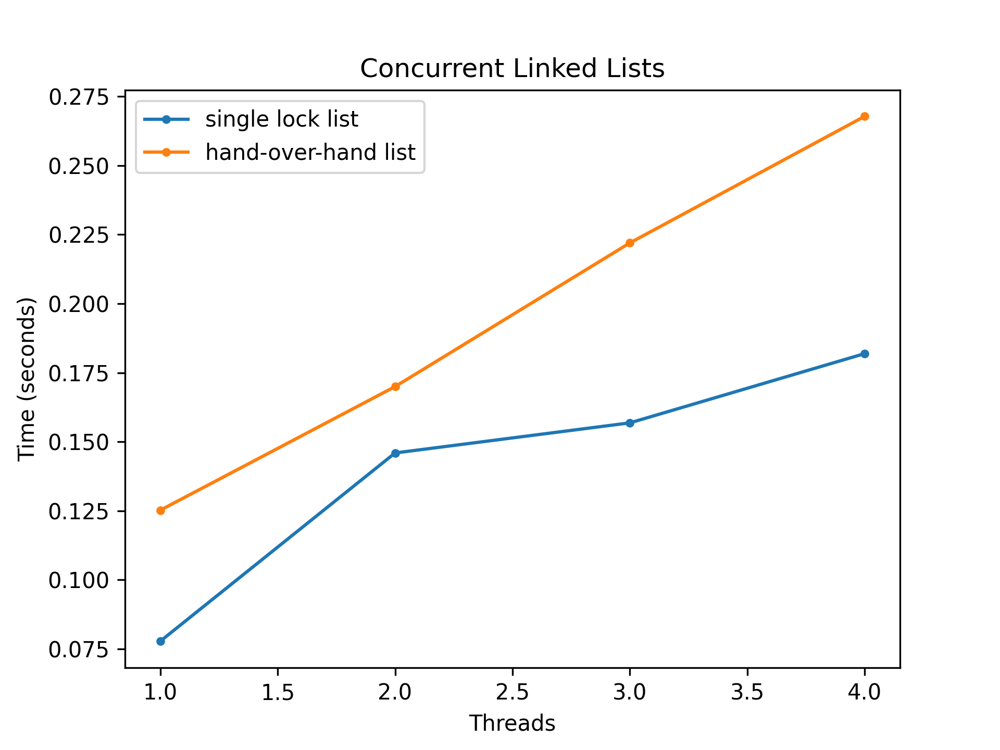

For all the questions below on timing and plotting the times I used a **2.7 GHz Dual-Core Intel Core i5** processor with **macOS 11.1** (Big Sur).

1. We'll start by redoing the measurements within this chapter. Use the call `gettimeofday()` to measure time within your program. How accurate is this timer? What is the smallest interval it can measure? Gain confidence in its workings, as we will need it in all subsequent questions. You can also look into other timers, such as the cycle counter available on `x86` via the `rdtsc` instruction.

    `gettimeofday()` is accurate enough for me. All that's important here is that there is a way measure each program and then use those measurements to compare other measurements.

2. Now, build a simple concurrent counter and measure how long it takes to increment the counter many times as the number of threads increases. How many CPUs are available on the system you are using? Does this number impact your measurements at all?

    The `sysctl hw.physicalcpu` command returns 2 CPUs, however, the `sysconf(_SC_NPROCESSORS_ONLN)` C function returns 4. I imagine I have two physical cores and 4 virtualized cores. I am sure this number impacts my measurements but I don't have another system to test it on.

    [counter code](https://github.com/breakthatbass/OStep/blob/main/chap29/counter.c)

    **Counter**
    ```
    threads: 1
    count: 1000000
    time: 0.028296

    threads: 2
    count: 2000000
    time: 0.122237

    threads: 3
    count: 3000000
    time: 0.193724

    threads: 4
    count: 4000000
    time: 0.283017
    ```

3. Next, build a version of the sloppy counter. Once again, measure its performance as the number of threads varies, as well as the threshold. Do the numbers match what you see in the chapter?

    In the book a threshold of 1 took about 12 seconds to complete. A threshold of 2 took about 6 seconds. My program (copied from the book) took 0.6 seconds with a threshold of 1 and just under a half of a second for a threshold of 2. And starts to match the book around a threshold of 32. I have a similar processor archtiecture to the one used in the book, however, I believe the book's OS is Linux. So I imagine that might have something to do with the difference. 

    [counter code](https://github.com/breakthatbass/OStep/blob/main/chap29/sloppycounter.c)

    


4. Build a version of a linked list that uses hand-over-hand locking [MS04], as cited in the chapter. You should read the paper first to understand how it works, and then implement it. Measure its performance. When does a hand-over-hand list work better than a standard list as shown in the chapter?

    [hand-over-hand list code](https://github.com/breakthatbass/OStep/blob/main/chap29/hoh-list.c)
    [single lock list](https://github.com/breakthatbass/OStep/blob/main/chap29/conc-list.c)

    the hand-over-hand list is always a bit slower no matter what on my system.

    **hand-over-hand list**
    ```
    threads: 1
    count: 1000000
    time: 0.125221

    threads: 2
    count: 2000000
    time: 0.169981

    threads: 3
    count: 3000000
    time: 0.222011

    threads: 4
    count: 4000000
    time: 0.267852
    ```
    **normal concurrent list**
    ```
    threads: 1
    count: 1000000
    time: 0.077794

    threads: 2
    count: 2000000
    time: 0.145959

    threads: 3
    count: 3000000
    time: 0.156857

    threads: 4
    count: 4000000
    time: 0.181931
    ```

    

5. Pick your favorite data structure, such as a B-tree or other slightly more interesting structure. Implement it, and start with a simple locking strategy like a simgle lock. Measure its performance as the number of concurrent threads increases.

    [single lock binary tree](https://github.com/breakthatbass/OStep/blob/main/chap29/conctree.c)

    I chose to do a binary tree since that's the only other data structure I'm somwhat comfortable with other than what we've already done (counters, linked lists).

    See below for details on timing.

6. Finally think of a more interesting locking strategy for this favorite data structure of yours. Implement it, and measure its performance. How does it compare to the straightforward locking approach?

    [individual node lock tree](https://github.com/breakthatbass/OStep/blob/main/chap29/hohtree.c)

    I made two binary trees similar to the two linked lists. One tree had a single lock in the root (which is just a pointer to the first node) and the other tree had a lock for each node. Similar to the lists, the tree with a lock in each node, like the hand-over-hand list, performed slower. Looking at the graph below, it performed dramatically slower than the single lock tree. I imagine an aproximation tree could come in handy here. Or maybe it could simply be omptimized by someone more skilled than me!

    